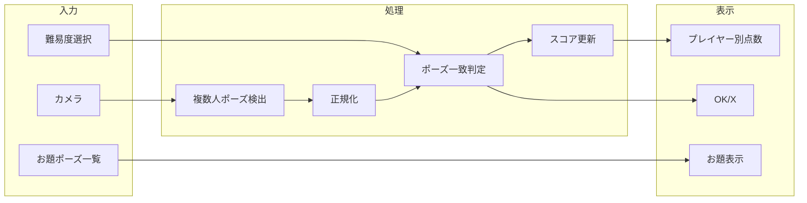

# ポーズ合わせゲームアプリ 実装プラン

## 現状

- [index.html](index.html) / [script.js](script.js): 手を上げてA/B投票するアプリ（**1人・MoveNet**）
- TensorFlow.js pose-detection 使用、17キーポイント（`left_wrist`, `right_shoulder` 等）

## 目標

| 要件    | 内容                         |
| ----- | -------------------------- |
| ゲーム内容 | お題ポーズと同じポーズをしたらOK、違えばXで判定  |
| 人数    | カメラ内で最大4人まで認識              |
| 難易度   | 3段階（例: かんたん / ふつう / むずかしい） |
| 対象    | 子供〜大人どちらも（体の大きさに依存しない判定）   |
| 表示    | 画面上部に各プレイヤーのトータル点数         |
| 音楽    | BGMを再生（ファイルは後から配置する想定）     |

---

## 1. アーキテクチャ概要

---

## 2. 技術選定

### 2.1 複数人ポーズ検出

- **採用案**: `@tensorflow-models/pose-detection` の **PoseNet** を `multiPose: true`, `maxPoses: 4` で使用
- **理由**: 既存が pose-detection API のため流用しやすく、PoseNet のみが複数ポーズ対応。17キーポイントは MoveNet と同様で名前も共通。
- **代替**: MediaPipe Pose Landmarker（`num_poses: 4`）も可能だが、API・キー名が異なるため差し替えコストが大きい。

### 2.2 ポーズ一致判定（子供・大人共通）

- **正規化**（体の大きさ・位置に依存しないようにする）:
  - 重心（例: 両肩・両腰の中心）を原点に平行移動
  - スケールは「肩幅」または「胴の長さ」で割って統一
- **類似度**: 正規化後の対応キーポイント同士の距離の平均、または余弦類似度。信頼度が低いキーポイントは重みを下げる。
- **難易度**: 閾値でOK/Xを切り替え
  - かんたん: 類似度 ≥ 約70%
  - ふつう: ≥ 約80%
  - むずかしい: ≥ 約90%

（実際の数値は実装時に調整）

### 2.3 お題ポーズの定義

- キーポイント座標の配列をあらかじめJSONなどで保持（例: 「右手上げ」「ガッツポーズ」「Y字」など5〜10種類）
- 表示はキャンバスでスケルトン（線でつないだ図）を描画するか、簡易イラストを並べる

### 2.4 音楽再生

- **方式**: HTML5 `<audio>` でBGMを再生。音楽ファイルは後からユーザーが配置する前提で、パスだけ用意しておく。
- **配置場所**: プロジェクト直下に `music/` フォルダを用意し、その中に `bgm.mp3`（または `bgm.ogg`）を置けるようにする。実装時は `music/bgm.mp3` を `src` に指定し、ファイルが無くてもエラーで止まらないようにする（再生失敗時は静かにスキップ）。
- **再生タイミング**: ゲーム開始時（難易度選択後や「スタート」押下後）に再生開始。ループ再生（`loop` 属性）。
- **後からアップする場合**: あとで音楽を追加するときは、`music/bgm.mp3` にファイルを置くだけで再生されるようにする。複数曲やファイル名を変えたい場合は、`script.js` 内の再生パス（例: `const BGM_PATH = 'music/bgm.mp3'`）を1箇所変えればよいようにする。

---

## 3. 画面・UI構成（変更は必要最小限）

- **画面上部**: プレイヤー1〜4の「トータル点数」を横並び（カードまたはバッジ）
- **その下**: 難易度選択（3ボタン or セレクト）
- **中央付近**: 左（または上）に「お題ポーズ」のスケルトン/説明、右（または下）にカメラ映像
- **カメラ上**: 各検出人物にラベル（P1〜P4）と、直近判定の OK/X を表示
- 既存の投票用カード・グラフは削除し、ゲーム用レイアウトに差し替え
- **音楽**: `<audio id="bgm" loop>` を配置し、`src` は `music/bgm.mp3`（後から配置するファイル）。再生は script で制御。音楽用フォルダ `music/` は空のまま作成しておく（.gitkeep 等）。

---

## 4. ゲームフロー

1. 難易度を選ぶ → お題ポーズが1つ表示される
2. カメラで最大4人を検出し、毎フレーム各人物のポーズを取得
3. お題ポーズと正規化した上で類似度を計算し、難易度の閾値でOK/X判定
4. 「OK」と判定されたらそのプレイヤーに1点加算（連続加算を防ぐため短いクールダウンを入れる想定）
5. お題は一定時間で切り替える、または「次のポーズ」ボタンで手動切り替え（どちらかは要検討）

---

## 5. ファイル変更方針

| ファイル                     | 変更内容                                                                                                                                                                                                                                                          |
| ------------------------ | ------------------------------------------------------------------------------------------------------------------------------------------------------------------------------------------------------------------------------------------------------------- |
| [index.html](index.html) | タイトル・見出しをゲーム用に変更。投票用カード・グラフを削除し、難易度選択・お題表示エリア・プレイヤー別点数表示を追加。BGM用に `<audio id="bgm" loop>` を追加（src は script で設定するか、`music/bgm.mp3` を指定）。                                                                                                                       |
| [script.js](script.js)   | (1) MoveNet → PoseNet（multiPose, maxPoses: 4）に変更 (2) 正規化＋類似度計算の関数を追加 (3) お題ポーズデータと描画 (4) 難易度別閾値とOK/X判定 (5) プレイヤー別スコア保持・表示 (6) ループで4人分を順に判定し、カメラ上にOK/X表示 (7) BGM: 再生パスを定数（例: `music/bgm.mp3`）で持ち、ゲーム開始時に `audio.play()`、ファイル未配置時は `play().catch()` で握りつぶさずログのみ |
| `music/` フォルダ            | 空で作成。あとでユーザーが `bgm.mp3` などを配置する。README やコメントで「音楽は music/bgm.mp3 に置く」と明記する。                                                                                                                                                                                    |

（UIは指示があるまで変更しないというルールに合わせ、レイアウト変更は「ゲーム用に必要最小限」とし、見た目の装飾は行わない前提で記載）

---

## 6. 実装時の注意

- **キーポイント名**: PoseNet と MoveNet で COCO 17 キーポイント名が同じか必ず公式ドキュメントで確認する
- **プレイヤーIDの安定化**: フレーム間で「誰が誰か」を一致させるため、前フレームの位置に近い検出を同じプレイヤーに割り当てる（距離ベースのマッチング）
- **クールダウン**: 同一プレイヤーで連続して加点しすぎないよう、OK判定後に数秒は同じお題では加点しない
- **信頼度**: `keypoint.score` が低い部位は類似度計算から除外するか重みを下げる

---

## 7. 未確定・要確認

- **お題の切り替え**: 自動（タイマー）か、手動（ボタン）か、または両方用意するか
- **お題の数**: 最初は5個程度でよいか、それ以上欲しいか
- **OK/Xの表示方法**: カメラ上のラベル横にテキストで「OK」「X」を出すか、色やアイコンのみか

これらは実装前に決めると実装がぶれません。必要なら「自動30秒＋次のポーズボタン」「お題は8個」「テキストでOK/X」のように仕様を固定してから実装することを推奨します。